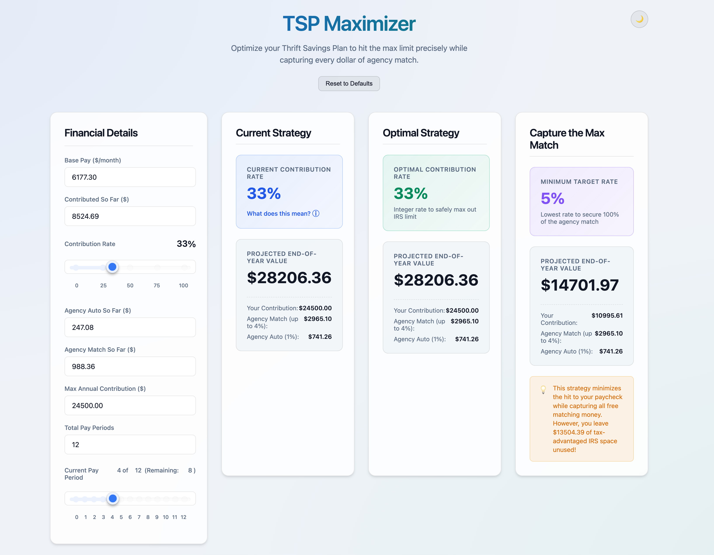

# TSP Contribution Maximizer

[](https://github.com/the-hcma/tsp-maximizer/actions/workflows/ci.yml)
[](https://github.com/the-hcma/tsp-maximizer/actions/workflows/release-please.yml)
[](https://www.npmjs.com/package/@the-hcma/tsp-maximizer)
[](https://www.npmjs.com/package/@the-hcma/tsp-maximizer)
[](LICENSE)

A lightweight, highly accurate React/TypeScript web utility designed to optimize Thrift Savings Plan (TSP) contribution rates for federal employees (BRS/FERS).



> **⚠️ Disclaimer: Not Financial Advice**
>
> This tool is provided for informational and educational purposes only. It is **not** financial, tax, or investment advice. The calculations are based on publicly available payroll rules and may not reflect your specific situation, agency payroll system, or plan changes. Always consult your agency's HR/payroll office or a qualified financial advisor before making contribution changes.
>
> **Use this application at your own risk.** The authors assume no responsibility for any financial decisions made based on its output.
>
> **Learn more about the TSP and BRS/FERS programs:**
> - [Thrift Savings Plan — Official Website](https://www.tsp.gov)
> - [TSP Contribution Limits](https://www.tsp.gov/making-contributions/contribution-limits/)
> - [Blended Retirement System (BRS) Overview](https://militarypay.defense.gov/BlendedRetirement/)
> - [FERS Retirement Information — OPM](https://www.opm.gov/retirement-services/fers-information/)

Federal payroll systems strictly calculate agency matching on a per-pay-period basis. If you contribute too much early in the year and hit the annual IRS limit, your contributions will be abruptly cut off—meaning you lose out on the free 4% agency match for the remaining pay periods. 

This tool dynamically simulates the exact mathematical mechanics of federal payroll processors (like DFAS and NFC) to help you choose the precise contribution percentage needed to safely max out your IRS limit without leaving any matching money on the table.

## Running It

### No-install (run directly with npx)

If you prefer not to install anything globally, you can run it on demand.

To run `tsp-maximizer`, you must open your command-line interface:

- **macOS**: Open the **Terminal** app (press `Cmd + Space`, type "Terminal", and press Enter).
- **Windows**: Open **PowerShell** or **Command Prompt** (press the Windows key, type "PowerShell", and press Enter).
- **Linux**: Open your preferred terminal emulator (e.g., GNOME Terminal, Konsole).

Once your terminal is open, copy and paste the following command:

```bash
npx @the-hcma/tsp-maximizer
```

### Install once, run anywhere

```bash
npm install -g @the-hcma/tsp-maximizer
tsp-maximizer
```

This installs the `tsp-maximizer` command globally so you can launch the app from any terminal, any time — no project folder needed. The browser opens automatically.

To access it from another device on your network (e.g. your phone, or a remote/headless machine):

```bash
tsp-maximizer --host
```

Both options require Node.js 18+. Don't have it? Install it for your platform:

**macOS**
```bash
# Install Homebrew (https://brew.sh) then:
brew install node
```

**Windows**

Download the LTS installer from [nodejs.org](https://nodejs.org).

**Linux (Ubuntu/Debian)**
```bash
curl -fsSL https://deb.nodesource.com/setup_lts.x | sudo -E bash -
sudo apt-get install -y nodejs
```

## Features
- **Real-Time Strategy Comparison:** Compare your current contribution trajectory against the mathematically "Optimal" strategy and the "Capture the Max Match" (minimum impact) strategy side-by-side.
- **Fractional Pay Period Simulation:** Accurately models the exact edge cases of federal payroll, such as hitting the IRS limit mid-pay-period and evaluating if the fractional spillover is large enough to trigger the 5% matching threshold.
- **Dynamic Lost Match Alerts:** Explicitly calculates and warns you exactly how many dollars of agency matching you are leaving on the table if you undercontribute or overcontribute.
- **Premium Interface:** Built with a fully responsive, glassmorphic UI with dark and light mode support.

## Getting Started (Development)

This section is for contributors who want to run or modify the source code locally.

### Prerequisites

Install Node.js 18+ (see [Running It](#running-it) above for platform instructions), then enable `pnpm`:

```bash
corepack enable pnpm
```

### Setup

1. Clone the repository:
   ```bash
   git clone https://github.com/the-hcma/tsp-maximizer.git
   cd tsp-maximizer
   ```

2. Install dependencies:
   ```bash
   pnpm install
   ```

3. Start the development server — the app will open automatically in your browser:
   ```bash
   pnpm run dev
   ```

To expose the dev server on your local network (useful for testing on other devices, or when running headlessly):
```bash
pnpm run dev --host
```

### Building for Production

```bash
pnpm run build
```
The compiled assets will be placed in the `dist/` directory, ready to be deployed to any static hosting service.

## Tech Stack
- **Framework:** React 19
- **Build Tool:** Vite
- **Language:** TypeScript
- **Styling:** Vanilla CSS (CSS Variables, Flexbox/Grid)
- **Package Manager:** `pnpm`

## License
MIT License — Copyright © 2026 Henrique Andrade
